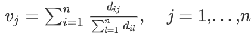

# A simple and fast algorithm for K-medoids clustering (2009)
저자 : Hae-SangPark, Chi-HyuckJun

   

### 가정
* N개 row, p개 변수를 가지고 있을 때, k개의 클러스터를 만듬.
* X_ij : i번째 row, j번째 column(feature)
* d_ij : i번째 row(object)와 j번째 row 사이의 Euclidean distance.
 
### 방법
* Initial medoids
  * 모든 row(object)에 대해 distance를 계산함.
	* vj를 계산함.
  

  * vj 값들을 오름차순으로 정렬하여(총 n개가 있음) 처음 값 ~ k까지의 값들을 initial medoids로 선택함.
	* 각 data point를 가장 가까운 medoids로 할당하여 초기 클러스터를 얻음
	* Medoids에서 모든 객체로부터 distance의 합을 계산함.
* Update medoids
	* 각 cluster의 medoid에서 cluster 안에 있는 모든 객체(data point)의 distance의 합의 값이 최소가 되는 medoid를 찾음. (계속해서 update 함을 의미함)
* Assign objects to medoids
	* 각각의 object를 가장 가까운 medoid로 할당하여 cluster를 얻음.
	* 각 Medoids 기준으로 모든 객체로부터 Distance가 Update 전과 같으면 알고리즘이 끝남.
