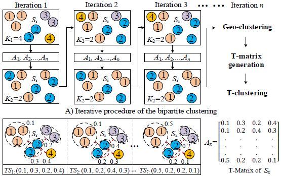

# Trafic Prediction in a Bike Sharing System (2015)
저자 : Yexin Li, Yu Zheng, Huichu Zhang, Lei Chen

   
  
### 클러스터 방법

#### Bipartite Station Clustering
Step 1. Geo-Clustering : Algorithm 최초 1회 때는 Step 1-1, 그 이후는 1-2를 수행합니다.
* Step 1-1. (최초 1회 수행)
  * 자전거 정류소의 위도, 경도 데이터를 기준으로 K-means Clustering을 통해 K1개의 Cluster를 만듭니다. 
   

* Step 1-2. (1회 이후부터 수행)
  * T-Clustering 한 K2개의 Cluster 각각에 대해 1-1의 Geo-Clustering을 적용하여 총 K1개의 Cluster를 형성합니다.  
    * T-Cluster에 Geo-clustering을 할 때 각각의 클러스터 개수 : [(N1*K1)/n], [(N2*K1)/n] , ... , [(NK2*K1)/n]  
    * N1 : Step 2의 Clustering을 했을 때 C1 안에 들어있는 자전거 정류장 수
    * K1 : Step 1의 Clustering 할 때 클러스터 개수
    * n : 전체 정류장 개수
    * 이 부분은 아래의 Fig1을 참조하시면 이해가 빠를 수 있습니다.
      
    
* Step 2. T-matrix Generation
  * 7개의 time slot을 만듭니다.
    * 평일 7:00am - 11:00am
    * 평일 11:00am - 4:00pm
    * 평일 4:00pm - 9:00pm
    * 평일 9:00pm - 7:00am
    * 주말 0:00am - 9:00am
    * 주말 9:00am - 7:00pm
    * 주말 7:00pm - 12:00pm
  
  * 7개의 time slot값을 이용하여 A라는 t-matrix를 만듭니다.
    * Ai : 정류소 i의 matrix A
    * (Ai)의 (l,j) : time slot l에 자전거 정류소 Si로부터 cluster C1,j로 check-in 될 확률. (C1은 Step 1의 Geo-Clustering으로 만든 클러스터를 지칭합니다)
    -> 각 Check-in에 대한 조건부 확률은 maximum likelihood estimation으로 추정됩니다.(Check-in 기록을 데이터로 씀)
   
  
* Step 3. T-Clustering
  * t-matrices를 기준으로 K-means Clustering을 통해 K2개의 Cluster를 만듭니다. (단, K1 > K2)
   
  
* Step 4 : T-clustering 데이터에 대해 1-2, 2, 3 작업을 반복합니다.
  * 전의 결과값과 같거나 특정 횟수까지 이를 반복하게 됩니다.
  

#### Fig1

 
* Fig1의 (A)를 보면 K1개로 Clustering하는 부분이 있는데 여기가 Geo-Clustering입니다.
* K2개로 Clustering 하는 것은 T-Clustering을 하는 것입니다.
  * K2개로 Clustering 하면 C1, C2, C3, C4까지 총 4개의 클러스터가 발생하게 됩니다.
  * K2개로 Cluster 한 뒤 다시 K1개로 클러스터 하는 것을 볼 수 있는데 이는 반납하는 정류소에 따라 클러스터링을 하게 되면 output 클러스터가 위도, 경도 상으로 떨어지게 됩니다. 이를 다시 묶기 위해 K1개로 다시 클러스터링 하는 것입니다.
    * C1에 대해 [(N1*K1)/n]개로 Clustering 하고 C2에 대해 [(N2*K1)/n] 하여 총 C4까지 이를 적용합니다.
  * 다시 K1개의 클러스터로 되며 이를 반복합니다.
